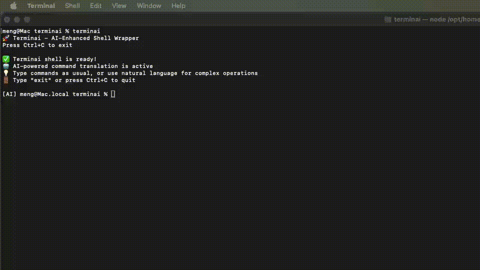

# 🤖 Terminai

**An AI-enhanced shell wrapper that bridges natural language and command line**

Terminai transforms your terminal experience by adding AI-powered command translation on top of your existing shell. Write commands naturally or use plain English - terminai understands both.
## 🎬 Demo



## ✨ Features

- **🔄 Seamless Shell Integration** - Works as a wrapper around your existing shell (zsh/bash)
- **🤖 AI Command Translation** - Failed commands automatically get translated from natural language
- **🛡️ Safety First** - Always asks for confirmation before executing AI-generated commands
- **⚡ Smart Tab Completion** - Complete file paths and commands just like your native shell
- **🔐 Secure API Management** - Safely stores your Gemini API key with proper permissions
- **🎯 Enhanced Prompt** - Clear `[AI]` indicator shows when AI features are active

## 🚀 Quick Start

### Prerequisites

**Node.js** (version 16.0 or higher) must be installed on your system.
- Install via package manager (e.g., `brew install node` on macOS, `apt-get install nodejs npm` on Ubuntu)
- Download from [nodejs.org](https://nodejs.org/)


### Installation

```bash
npm install -g @menguzat/termin-ai
```

### Setup

1. **Get a Gemini API Key** from [Google AI Studio](https://makersuite.google.com/app/apikey)

2. **Launch Terminai**
   ```bash
   terminai
   ```

3. **Enter your API key** when prompted (saved securely to `~/.terminai/config.json`)

That's it! You're ready to use AI-enhanced commands.

## 💡 Usage Examples

### Regular Commands Work Normally
```bash
[AI] user@hostname project % ls -la
[AI] user@hostname project % cd src/
[AI] user@hostname src % pwd
```

### AI-Powered Command Translation
When a command fails, terminai automatically asks AI for help:

**Simple Example:**
```bash
[AI] user@hostname project % what's my wifi ip address
🤖 Command failed. Attempting AI translation...
🔄 Asking AI to translate the command...
💡 AI suggests: ifconfig en0 | grep inet | grep -v inet6 | awk '{print $2}'
❓ Execute this command? (y/N): y
✅ Executing AI-suggested command...
192.168.1.34
```

**Complex Media Processing:**
```bash
[AI] user@hostname project % use ffmpeg to replace the audio of video filename.mp4 with audio from audio.wav
🤖 Command failed. Attempting AI translation...
💡 AI suggests: ffmpeg -i filename.mp4 -i audio.wav -c:v copy -c:a aac -map 0:v:0 -map 1:a:0 -y output.mp4
❓ Execute this command? (y/N): y
```

**Advanced File Operations:**
```bash
[AI] user@hostname project % find all javascript files modified in the last 3 days and copy them to a backup folder
💡 AI suggests: find . -name "*.js" -mtime -3 -type f -exec cp {} backup/ \;
❓ Execute this command? (y/N): y
```

**System Administration:**
```bash
[AI] user@hostname project % show me all processes using more than 100MB of memory sorted by usage
💡 AI suggests: ps aux | awk '$6 > 100000 {print $0}' | sort -k6 -nr
❓ Execute this command? (y/N): y
```

**Network Troubleshooting:**
```bash
[AI] user@hostname project % check which process is using port 3000 and kill it
💡 AI suggests: lsof -ti:3000 | xargs kill -9
📝 Explanation: Find process ID using port 3000 and forcefully terminate it
❓ Execute this command? (y/N): y
```

### Smart Tab Completion
```bash
[AI] user@hostname project % cp tsconfig<TAB>
tsconfig.json

[AI] user@hostname project % cd src/<TAB>
shell.ts  ai-service.ts  config.ts  cli.ts

[AI] user@hostname project % npm run <TAB>
build  start  test
```


*Your support helps keep terminai free and continuously improving! 🚀*

## 🔧 How It Works

1. **Command Execution**: Terminai first tries to execute your input as a regular shell command
2. **AI Translation**: If the command fails (non-zero exit code), it sends your input to Google's Gemini AI
3. **Smart Suggestions**: The AI interprets your natural language and suggests appropriate shell commands
4. **User Confirmation**: You review and approve the suggestion before execution
5. **Safe Execution**: The suggested command runs with full output, just like typing it yourself

## 🛡️ Security & Privacy

- **API Key Storage**: Your Gemini API key is stored locally in `~/.terminai/config.json` with user-only permissions (600)
- **No Command Logging**: Your commands and AI interactions are not stored or transmitted anywhere except to Google's Gemini API
- **User Confirmation**: AI suggestions always require explicit approval before execution
- **Sandboxed Execution**: Commands run in your current directory with your user permissions

## 🎯 Perfect For

- **Complex Media Processing**: FFmpeg operations, image manipulation, video conversion
- **System Administration**: Log analysis, process management, disk cleanup
- **Development Workflows**: Git operations, build automation, dependency management  
- **Data Processing**: CSV manipulation, JSON parsing, text processing with awk/sed
- **Network Operations**: Port scanning, connectivity testing, firewall configuration
- **File Management**: Batch operations, recursive searches, permission changes

## 💖 Support the Project

If terminai has made your command line experience better, consider supporting its development:

<div align="center">

| Cryptocurrency | Address | QR Code |
|---|---|---|
| **Bitcoin (BTC)** | `bc1qy6nwnlzfxxr45kav5qnm72fr4s8607e02ace6f` |  |
| **Ethereum (ETH)** | `0x1a6ba4d715553abdadac32817bee35ca1ec3c04a` |  |
| **Solana (SOL)** | `5PMFQwZJAZg8oVFBKwCmuK8r2vv5F2cRcbGJBGuZNUFF` |  |
| **Binance Coin (BNB)** | `0x1a6ba4d715553abdadac32817bee35ca1ec3c04a` |  |

</div>

## 🔧 Configuration

### Config File Location
```
~/.terminai/config.json
```

### Reset Configuration
```bash
rm ~/.terminai/config.json && terminai
```

## 🎨 Examples Gallery

```bash
# Media & Content Processing
"convert all png images to webp format with 80% quality"
→ for file in *.png; do cwebp -q 80 "$file" -o "${file%.png}.webp"; done

"extract audio from video.mp4 as high quality mp3"
→ ffmpeg -i video.mp4 -vn -acodec libmp3lame -q:a 0 audio.mp3

"resize all images in current directory to 800px width maintaining aspect ratio"
→ for img in *.jpg *.png; do convert "$img" -resize 800x "${img%.*}_resized.${img##*.}"; done

# Advanced File Operations
"find duplicate files by content and show their paths"
→ find . -type f -exec md5sum {} \; | sort | uniq -d -w32

"compress all log files older than 30 days"
→ find /var/log -name "*.log" -mtime +30 -exec gzip {} \;

"show directory sizes sorted from largest to smallest"
→ du -sh */ | sort -hr

# Development & Git Operations  
"show git commits from last week with file changes"
→ git log --since="1 week ago" --stat --oneline

"find all TODO comments in typescript files"
→ grep -r "TODO" --include="*.ts" --include="*.tsx" . -n

"run prettier on all modified files in git"
→ git diff --name-only --cached | grep -E '\.(ts|js|tsx|jsx)$' | xargs prettier --write

# System Monitoring & Administration
"show top 10 largest files in home directory"
→ find ~ -type f -exec ls -la {} \; | sort -k5 -nr | head -10

"monitor network connections every 2 seconds"
→ watch -n 2 'netstat -tuln | grep LISTEN'

"check ssl certificate expiration for domain.com"
→ echo | openssl s_client -servername domain.com -connect domain.com:443 2>/dev/null | openssl x509 -noout -dates

# Data Processing & Analysis
"convert csv to json preserving headers"
→ python3 -c "import csv, json, sys; print(json.dumps([dict(r) for r in csv.DictReader(sys.stdin)]))" < data.csv

"extract all email addresses from text files"
→ grep -hoE '[a-zA-Z0-9._%+-]+@[a-zA-Z0-9.-]+\.[a-zA-Z]{2,}' *.txt | sort -u

"count unique IP addresses in apache log"
→ awk '{print $1}' access.log | sort | uniq -c | sort -nr
```

## 🚀 Advanced Usage

### Chaining Commands
```bash
[AI] user@hostname project % build and test the project
💡 AI suggests: npm run build && npm test
```

### Directory Navigation
```bash
[AI] user@hostname project % go to parent directory and list files
💡 AI suggests: cd .. && ls -la
```

### File Search
```bash
[AI] user@hostname project % find large files bigger than 100MB
💡 AI suggests: find . -size +100M -type f -exec ls -lh {} \;
```

## 🛠️ Technical Details

- **Built with**: TypeScript + Node.js
- **AI Model**: Google Gemini 2.5 Flash Preview
- **Shell Integration**: Spawns zsh/bash processes for command execution
- **Completion System**: Custom tab completion with file and command support
- **Cross-Platform**: See Platform Compatibility section below

## 🖥️ Platform Compatibility

### ✅ Fully Tested & Supported
- **macOS** - Extensively tested and working perfectly with zsh/bash

### ⚡ Should Work (Not Yet Fully Tested)  
- **Linux** - Should work out-of-the-box on most distributions with bash/zsh
- **Windows** - Should work but may have minor compatibility issues
  - May require manual shell configuration in some cases
  - Cross-platform improvements planned (see our GitHub issues)

### 🔄 Testing Status
We're actively working on comprehensive cross-platform testing. If you encounter issues on Linux or Windows, please [report them](https://github.com/menguzat/terminai/issues) - we'd love your feedback to improve compatibility!

## 📝 Development

```bash
# Clone the repository
git clone <repo-url>
cd terminai

# Install dependencies
npm install

# Build
npm run build

# Test locally
npm link
terminai
```

## 🤝 Contributing

Contributions welcome! Please feel free to submit a Pull Request.

## 🚀 Upcoming Features

We're constantly working to improve terminai! Here's what's coming next:

- **🔄 Regenerate Command** - Didn't like the AI suggestion? Get alternative command options with a simple regenerate
- **🛡️ Enhanced Error Handling** - Better recovery and suggestions when commands fail or produce errors
- **💬 Multi-turn AI Context** - AI remembers your conversation for more intelligent follow-up commands and suggestions

Stay tuned for more exciting features! 🎯

## 📄 License

MIT License - see LICENSE file for details.

---

**Happy commanding! 🚀**

*Transform your terminal experience with the power of AI* 